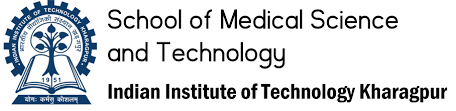

# Mathew Manoj - Data Scientist & AI Enthusiast 🌟

Hi, I'm Mathew Manoj! I'm a tech enthusiast currently studying Biotechnology at IIT Kharagpur. My journey started with a love for both biotech and tech, and I've had a blast combining these fields. From building chatbots with AWS to predicting stock prices with machine learning, I've enjoyed every step of the way.

I've interned at some cool places like Tech Mahindra Maker's Lab, Cellstrat, and EY, where I worked on exciting projects like sales prediction models and knowledge mining chatbots. Looking ahead, I'm excited to explore how AI can be used on devices like Raspberry Pi and continue working on innovative biotech solutions. My goal is to create impactful AI projects that can help make a difference in the world.

## 🚀 Technical Skills
- **Languages:** Python, C++
- **Libraries/Frameworks:** TensorFlow, Pandas, Numpy, Seaborn, Matplotlib, Scikit-Learn, Scipy
- **Developer Tools:** Visual Studio Code, Google Colab, Jupyter Notebook, MATLAB, XCode
- **Cloud Services:** AWS (including AWS Bedrock)
- **Other Tools:** Git

## 🎓 Education
- **M.Tech Dual Degree, Biotechnology** | IIT Kharagpur (Expected 2026)
- **Higher Secondary (XII)** | FIITJEE World School (2021)
- **Secondary (X)** | FIITJEE World School (2018)

## 💼 Work Experience

**Tech Mahindra Maker's Lab | AI Research Intern | Pune (Jun '24 - Present)**
- Doing research on deploying LLM models onto edge devices like raspberry pi.
- Contributing to Project Indus, building LLMs for Indian languages.
- Engaging in foundational AI research for scalable AI systems.

 

**Cellstrat | Data Science Intern | Bangalore (Jan '24 - Mar '24)**
- Enhanced a Knowledge Mining chatbot with AWS services.
- Developed a chatbot using the Amazon Titan model for an AWS workshop.
- Evaluated over 50 different voices and 30-40 prompts for PhoneCallGPT.

 

**Ernst and Young (EY) | Data Analytics Intern | Bangalore (Jun '23 - Jul '23)**
- Developed a 3-layer LSTM for sales prediction with an MAE of 0.0919.
- Implemented LeakyReLU activation and MSE loss for high prediction accuracy.

 

**Follicular Stage Identification Project | Computer Vision Research Intern | IIT Kharagpur (May '23 - Present)**
- Utilized 2D fluorescent images to categorize ovarian follicle stages.
- Analyzed images to measure cellular thickness and identify growth phases.

## 🛠️ Projects
### [More Projects](projects/README.md)
### Chatbot Development Using AWS | Intern Project (Jan '24)
- Built a chatbot with AWS Bedrock and AWS Lambda.
- Achieved successful output of up to 20 tokens, encountering challenges with higher token limits.
- Implemented a web adapter layer for streaming responses.

### Stock Price Prediction LSTM Model | Self Project (Jun '23 - Jul '23)
- Gathered Apple stock price data (2018-2023) for LSTM training.
- Developed a 3-layer stacked LSTM model with high accuracy (training loss: 0.0018, test loss: 0.0021).

### K-Means Clustering on Sales SAP Data | Self Project (May '23 - Jun '23)
- Conducted RFM analysis on sales data using K-Means clustering.
- Identified an optimal cluster count of 4 with silhouette scores.

## 🏆 Competitions & Conferences
### Unit Liability Prediction Model | Inter Hall Data Analytics Competition (Feb '23 - Mar '23)
- Developed a model predicting manufacturing unit safety with 97% accuracy, securing 1st place in accuracy.

### Construction of Fintech Website | Inter Hall Opensoft Competition (Mar '23)
- Developed a SaaS platform for financial services using React.js, Node.js, and MongoDB.

## 🏅 Positions of Responsibility
### Academic Head | Kharagpur Game Theory Society | IIT Kharagpur (Aug '23 - Apr '24)
- Organized workshops on game theory concepts and coordinated the flagship event Stratathon.

## ⚽ Extracurricular Activities
- **Football:** Active member of the bronze-winning football team of Vidyasagar Hall of Residence.
- **Swimming:** Participant in events with the Technology Aquatics Society at IIT Kharagpur.
- **Cultural:** Organized Pongal celebrations for IIT Kharagpur Tamil Sangam, attracting over 200 attendees.

## 🔗 Let's Connect!
- [GitHub](https://github.com/mathew-2)
- [LinkedIn](https://www.linkedin.com/in/mathew-manoj)
- [Twitter](https://x.com/mattdraco13)

Feel free to explore my projects, and don't hesitate to reach out if you'd like to collaborate or have any questions!
