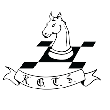

# Mathew Manoj - Data Science & AI Enthusiast 🌟

Welcome! I’m Mathew Manoj, currently pursuing my M.Tech Dual Degree in Biotechnology at IIT Kharagpur. My passion lies in blending biotechnology with cutting-edge AI and data science technologies. From building advanced chatbots to predicting stock prices with LSTM models, I’m constantly exploring how AI can solve real-world problems. With hands-on experience from internships at **Tech Mahindra Maker's Lab**, **Cellstrat**, and **Ernst & Young**, I’m particularly excited about exploring AI for edge devices and scalable AI solutions.

Take a look at my work, and feel free to connect if you're interested in collaborating!

## 🚀 Technical Skills
- **Languages:** Python, C++
- **Libraries/Frameworks:** TensorFlow, Pandas, Numpy, Seaborn, Matplotlib, Scikit-Learn, Scipy
- **Developer Tools:** Visual Studio Code, Google Colab, Jupyter Notebook, MATLAB, XCode
- **Cloud Services:** AWS (including AWS Bedrock)
- **Other Tools:** Git

 

## 🎓 Education
- **M.Tech Dual Degree, Biotechnology** | IIT Kharagpur (Expected 2026)
- **Higher Secondary (XII)** | FIITJEE World School (2021)
- **Secondary (X)** | FIITJEE World School (2018)

 

## 💼 Work Experience

**Tech Mahindra Maker's Lab**  
*AI Research Intern*  
*Pune (Jun '24 - Present)*

  

- Doing research on deploying LLM models onto edge devices like raspberry pi.
- Contributing to Project Indus, building LLMs for Indian languages.
- Engaging in foundational AI research for scalable AI systems.

 

**Cellstrat**  
*Data Science Intern*  
*Bangalore (Jan '24 - Present)*

  

- Enhanced a Knowledge Mining chatbot with AWS services.
- Developed a chatbot using the Amazon Titan model for an AWS workshop.
- Evaluated over 50 different voices and 30-40 prompts for PhoneCallGPT.

 

**Ernst and Young (EY)**  
*Data Analytics Intern*  
*Bangalore (Jun '23 - Jul '23)*

  

- Developed a 3-layer LSTM for sales prediction with an MAE of 0.0919.
- Implemented LeakyReLU activation and MSE loss for high prediction accuracy.

 

**Follicular Stage Identification Project**  
*Computer Vision Research Intern*  
*IIT Kharagpur (May '23 - Present)*

  

- Utilized 2D fluorescent images to categorize ovarian follicle stages.
- Analyzed images to measure cellular thickness and identify growth phases.

 

## 🛠️ Projects

### PubMed Paper Scraper | Self Project (July '24)
- A web app built with Streamlit to search and retrieve academic papers from PubMed based on user-defined topics.
- Displays key information like paper title, journal, publication date, and abstract with links to PubMed.
- Features error handling, rate limiting, and search capabilities for relevant papers.

- [PubMed Paper Scraper Website](https://pubmed-paper-scraper.streamlit.app/)
- [GitHub Repository](https://github.com/mathew-2/pubmed-paper-scraper)

---

### PDF to HTML Converter | Self Project (August '24)
- A web app that converts LinkedIn PDF resumes into professional HTML format using OpenAI's API.
- Built using Streamlit for the interface and PyPDF2 for extracting text from PDFs.
- Generates well-formatted HTML resumes based on extracted content.

- [PDF to HTML Converter Website](https://pdf-to-html-tamsyidwjjlsmqpzz2ekdz.streamlit.app/)
- [GitHub Repository](https://github.com/mathew-2/PDF-To-Html)

---

### Chatbot Development Using AWS | Intern Project (Jan '24)
- Built a chatbot with AWS Bedrock and AWS Lambda.
- Achieved successful output of up to 20 tokens, encountering challenges with higher token limits.
- Implemented a web adapter layer for streaming responses.

### [More Projects](projects/README.md)

 

## 🏆 Competitions & Conferences
### Unit Liability Prediction Model | Inter Hall Data Analytics Competition (Feb '23 - Mar '23)
- Developed a model predicting manufacturing unit safety with 97% accuracy, securing 1st place in accuracy.

### Construction of Fintech Website | Inter Hall Opensoft Competition (Mar '23)
- Developed a SaaS platform for financial services using React.js, Node.js, and MongoDB.

 

## 🏅 Positions of Responsibility

### Academic Head | Kharagpur Game Theory Society | IIT Kharagpur (Aug '23 - Apr '24)
- Organized workshops on game theory concepts and coordinated the flagship event Stratathon.

 

## ⚽ Extracurricular Activities
- **Football:** Active member of the bronze-winning football team of Vidyasagar Hall of Residence.
- **Swimming:** Participant in events with the Technology Aquatics Society at IIT Kharagpur.
- **Cultural:** Organized Pongal celebrations for IIT Kharagpur Tamil Sangam, attracting over 200 attendees.

## 🔗 Let's Connect!
- [GitHub](https://github.com/mathew-2)
- [LinkedIn](https://www.linkedin.com/in/mathew-manoj)
- [Twitter](https://x.com/mattdraco13)

Feel free to explore my projects, and don't hesitate to reach out if you'd like to collaborate or have any questions!
