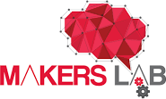
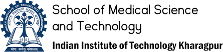
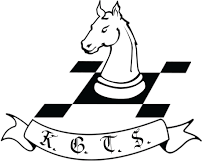

# Hi, I'm Mathew Manoj

<b>Data Science &amp; AI</b> · M.Tech Dual Degree, IIT Kharagpur

  

I'm a dual-degree student at **IIT Kharagpur** who builds and ships ML systems, from on-device LLMs to chatbots and predictive models. Most recently I was an **Applied Scientist Intern at Amazon**, fine-tuning and distilling a 1.5B-parameter LLM to run on edge devices. Before that I worked on LLMs and speech at **Prodoc AI**, **Tech Mahindra Maker's Lab**, **Cellstrat** and **EY**.

<a href="https://www.linkedin.com/in/mathew-manoj">LinkedIn</a> · <a href="https://github.com/mathew-2">GitHub</a> · <a href="https://x.com/mattdraco13">X</a>

## Technical Skills

<table class="skills">
  <tr>
    <td><b>Languages</b></td>
    <td>
      
      
    </td>
  </tr>
  <tr>
    <td><b>ML &amp; Data</b></td>
    <td>
      
      
      
      
      
      
      
      
    </td>
  </tr>
  <tr>
    <td><b>LLM &amp; Apps</b></td>
    <td>
      
      
      
    </td>
  </tr>
  <tr>
    <td><b>Cloud</b></td>
    <td>
      
    </td>
  </tr>
  <tr>
    <td><b>Tools</b></td>
    <td>
      
      
      
      
      
      
    </td>
  </tr>
</table>

## Experience

  <h3>Applied Scientist Intern</h3>
  
  
<b>Amazon</b> · Bangalore · May '25 – Oct '25

- Fine-tuned a **1.5B-parameter LLM** to decide between an **API call** and a **natural-language reply** on edge devices. <!-- TODO: add accuracy figure -->
- Used **distillation** to teach the model when to answer locally and when to hand off to the cloud.
- Reached production-level accuracy in both **API invocation** and **decision routing**.

  <h3>Data Science Intern</h3>
  
  
<b>Prodoc AI</b> · Bangalore · Dec '24

- Trained **DeBERTa** for **end-of-conversation detection** in healthcare voice apps. <!-- TODO: add accuracy / precision -->
- Built a **voice activity detection (VAD)** module to separate speech from noise, improving conversation timing.
- Deployed the model on **Hugging Face** and integrated it into Prodoc's healthcare apps.

  <h3>AI Research Intern</h3>
  
  
<b>Tech Mahindra Maker's Lab</b> · Pune · Jun '24 – Sep '24

- Researched **deploying LLMs on edge devices** such as the Raspberry Pi.
- Contributed to **Project Indus**, an LLM for Indian languages.

  <h3>Data Science Intern</h3>
  
  
<b>Cellstrat</b> · Bangalore · Jan '24
 <!-- TODO: add end date -->

- Improved a **knowledge-mining chatbot** on AWS and built an **Amazon Titan** chatbot for an AWS workshop.
- Evaluated **50+ voices** and **30–40 prompts** for PhoneCallGPT.

  <h3>Data Analytics Intern</h3>
  
  
<b>EY</b> · Bangalore · Jun '23 – Jul '23

- Built a **3-layer LSTM** for **sales forecasting** with an **MAE of 0.0919**, using LeakyReLU activations and MSE loss.

  <h3>Computer Vision Research Intern</h3>
  
  
<b>IIT Kharagpur</b> · Follicular Stage Identification · May '23
 <!-- TODO: add end date -->

- Classified **ovarian follicle stages** from **2D fluorescence images** by measuring cell-layer thickness to identify growth phases.

## Projects

<table class="projects">
  <tr>
    <td width="50%" valign="top">
       
      <b>Emotion-Led Candidate Analysis</b> 
      Self project · Aug '24
      Exploratory analysis of candidate profiles that charts emotion, sentiment and personality patterns to support data-driven recruitment. 
      <a href="https://github.com/mathew-2/Emotion-Led-Candidate-Analysis">Code</a>
    </td>
    <td width="50%" valign="top">
       
      <b>PubMed Paper Scraper</b> 
      Self project · Jul '24
      A Streamlit app that searches PubMed by topic and shows titles, journals, dates and abstracts, with error handling and rate limiting. 
      <a href="https://pubmed-paper-scraper.streamlit.app/">Live demo</a> · <a href="https://github.com/mathew-2/pubmed-paper-scraper">Code</a>
    </td>
  </tr>
  <tr>
    <td width="50%" valign="top">
      <b>PDF to HTML Resume Converter</b> 
      Self project · Aug '24
      Turns LinkedIn PDF resumes into polished HTML pages using PyPDF2 and the OpenAI API, with a Streamlit front end. 
      <a href="https://pdf-to-html-tamsyidwjjlsmqpzz2ekdz.streamlit.app/">Live demo</a> · <a href="https://github.com/mathew-2/PDF-To-Html">Code</a>
    </td>
    <td width="50%" valign="top">
      <b>AWS Bedrock Chatbot</b> 
      Internship project, Cellstrat · Jan '24
      A chatbot on AWS Bedrock and Lambda with a web adapter layer for streaming responses.
    </td>
  </tr>
</table>

**[More projects →](projects/README.md)**: stock prediction with an LSTM, K-means on SAP sales data, a movie recommender, and next-word prediction.

## Competitions

  <h3>WhatsApp Customer Insights Agent</h3>
  
<b>Meta Hackathon</b> · Oct '24

- Built a WhatsApp-based conversational agent on **Meta Llama** models to analyse customer satisfaction and identify product needs.
- Used **Python**, **LangChain**, **MongoDB** and **ChromaDB** for context retrieval.

  <h3>Unit Liability Prediction</h3>
  
<b>Inter-Hall Data Analytics Competition</b> · Feb – Mar '23

- Built a model predicting manufacturing-unit safety with **97% accuracy**, placing **1st in accuracy**.

  <h3>Fintech Website</h3>
  
<b>Inter-Hall Open Soft Competition</b> · Mar '23

- Developed a SaaS platform for financial services using **React.js**, **Node.js** and **MongoDB**.

## Positions of Responsibility

  <h3>Academic Head</h3>
  
  
<b>Kharagpur Game Theory Society</b> · IIT Kharagpur · Aug '23 – Apr '24

- Organised workshops on game theory and coordinated the society's flagship event, **Stratathon**.

## Education

| Degree | Institution | Year |
|---|---|---|
| **M.Tech Dual Degree, Biotechnology** | IIT Kharagpur | 2026 (expected) |
| **Higher Secondary (XII)** | FIITJEE World School | 2021 |
| **Secondary (X)** | FIITJEE World School | 2018 |

## Extracurriculars

- **Football:** member of the bronze-winning Vidyasagar Hall of Residence team.
- **Swimming:** competed in events with the Technology Aquatics Society, IIT Kharagpur.
- **Cultural:** organised Pongal celebrations for the IIT Kharagpur Tamil Sangam, drawing 200+ attendees.

## Let's Connect

Open to collaborations in LLMs, edge AI and applied ML. Reach me on <a href="https://www.linkedin.com/in/mathew-manoj">LinkedIn</a>, <a href="https://github.com/mathew-2">GitHub</a> or <a href="https://x.com/mattdraco13">X</a>.

