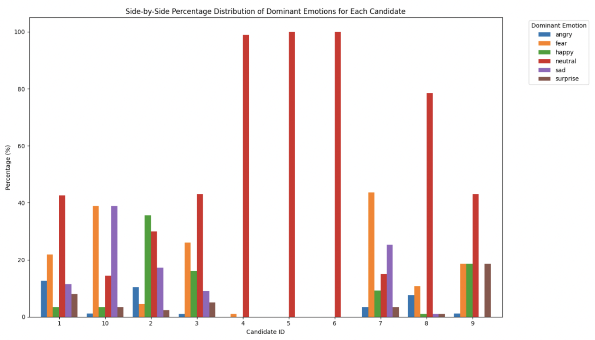
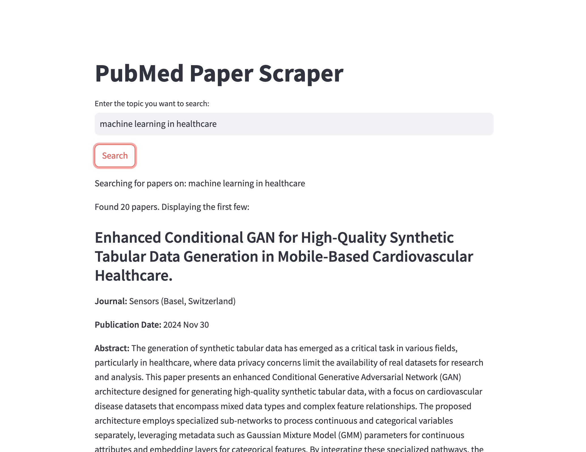

# Mathew Manoj - Data Science & AI Enthusiast 🌟

Hi, I’m Mathew Manoj, an undergraduate at IIT Kharagpur with hands-on experience from internships at **Tech Mahindra**, **Cellstrat**, and **Ernst & Young**. I love building AI solutions like chatbots and predictive models to solve real-world problems. Let’s connect!

Take a look at my work, and feel free to connect if you're interested in collaborating!

## 🚀 Technical Skills
- **Languages:** Python, C++
- **Libraries/Frameworks:** TensorFlow, Pandas, Numpy, Seaborn, Matplotlib, Scikit-Learn, Scipy
- **Developer Tools:** Visual Studio Code, Google Colab, Jupyter Notebook, MATLAB, XCode
- **Cloud Services:** AWS (including AWS Bedrock)
- **Other Tools:** Git

 

## 🎓 Education
- **M.Tech Dual Degree, Biotechnology** | IIT Kharagpur (Expected 2026)
- **Higher Secondary (XII)**            | FIITJEE World School (2021)
- **Secondary (X)**                     | FIITJEE World School (2018)

 

## 💼 Work Experience

### Tech Mahindra Maker's Lab  
*AI Research Intern*  
*Pune (Jun '24 - Sep '24)*

  

- Doing research on **deploying LLM models** onto edge devices like raspberry pi.
- Contributing to **Project Indus**, building LLMs for Indian languages.
- Engaging in foundational AI research for scalable AI systems.

 

### Cellstrat Inc  
*Data Science Intern*  
*Bangalore (Jan '24 - Present)*

  

- Enhanced a **Knowledge Mining chatbot** with AWS services.
- Developed a chatbot using the **Amazon Titan model** for an AWS workshop.
- Evaluated over **50 different voices** and **30-40 prompts** for PhoneCallGPT.

 

### Ernst and Young (EY) LLP 
*Data Analytics Intern*  
*Bangalore (Jun '23 - Jul '23)*

  

- Developed a **3-layer LSTM** for **sales prediction** with an **MAE** of **0.0919**.
- Implemented **LeakyReLU activation** and **MSE** loss for high prediction accuracy.

 

### Follicular Stage Identification Project  
*Computer Vision Research Intern*  
*IIT Kharagpur (May '23 - Present)*

  

- Utilized **2D fluorescent images** to categorize **ovarian follicle stages**.
- Analyzed images to measure cellular thickness and identify growth phases.

 

## 🛠️ Projects

### Emotion-Led Data Analysis | Self Project (Aug '24)
  
  
- Conducted exploratory data analysis (EDA) on **candidate profiles** to understand **emotion-led patterns** in recruitment.
- Visualized trends in **emotions**, **sentiments**, and **personality traits** using Python libraries like Matplotlib and Seaborn.
- Developed insights to enhance **data-driven recruitment** strategies.

- [GitHub Repository](https://github.com/mathew-2/Emotion-Led-Candidate-Analysis)

### PubMed Paper Scraper | Self Project (July '24)
  

- A web app built with Streamlit to search and retrieve **academic papers** from **PubMed** based on user-defined topics.
- Displays key information like **paper title**, **journal**, **publication date**, and **abstract** with links to PubMed.
- Features **error handling**, **rate limiting**, and **search capabilities** for relevant papers.

- [PubMed Paper Scraper Website](https://pubmed-paper-scraper.streamlit.app/)
- [GitHub Repository](https://github.com/mathew-2/pubmed-paper-scraper)

---

### PDF to HTML Converter | Self Project (August '24)
- A web app that converts **LinkedIn PDF resumes** into professional **HTML format** using OpenAI's API.
- Built using Streamlit for the interface and **PyPDF2** for extracting text from PDFs.
- Generates well-formatted HTML resumes based on extracted content.

- [PDF to HTML Converter Website](https://pdf-to-html-tamsyidwjjlsmqpzz2ekdz.streamlit.app/)
- [GitHub Repository](https://github.com/mathew-2/PDF-To-Html)

---

### Chatbot Development Using AWS | Intern Project (Jan '24)
- Built a chatbot with **AWS Bedrock** and **AWS Lambda**.
- Achieved successful output of up to **20 tokens**, encountering challenges with higher token limits.
- Implemented a web adapter layer for streaming responses.

### [More Projects](projects/README.md)

 

## 🏆 Competitions & Conferences
### Meta Hackathon (Oct '24)
- Created a WhatsApp-based conversational agent using Meta LLaMA models (LLama - 2.1B) to analyze customer
satisfaction and identify product needs
-  Used Python, LangChain, MongoDB, and ChromaDB to do the context retrieval
- [GitHub Repository](https://github.com/mathew-2/PDF-To-Html)
### Unit Liability Prediction Model | Inter Hall Data Analytics Competition (Feb '23 - Mar '23)
- Developed a model predicting manufacturing unit safety with 97% accuracy, securing 1st place in accuracy.

### Construction of Fintech Website | Inter Hall Opensoft Competition (Mar '23)
- Developed a SaaS platform for financial services using React.js, Node.js, and MongoDB.

 

## 🏅 Positions of Responsibility

### Academic Head | Kharagpur Game Theory Society | IIT Kharagpur (Aug '23 - Apr '24)
- Organized workshops on game theory concepts and coordinated the flagship event Stratathon.

 

## ⚽ Extracurricular Activities
- **Football:** Active member of the bronze-winning football team of Vidyasagar Hall of Residence.
- **Swimming:** Participant in events with the Technology Aquatics Society at IIT Kharagpur.
- **Cultural:** Organized Pongal celebrations for IIT Kharagpur Tamil Sangam, attracting over 200 attendees.

## 🔗 Let's Connect!
- [GitHub](https://github.com/mathew-2)
- [LinkedIn](https://www.linkedin.com/in/mathew-manoj)
- [Twitter](https://x.com/mattdraco13)

Feel free to explore my projects, and don't hesitate to reach out if you'd like to collaborate or have any questions!
